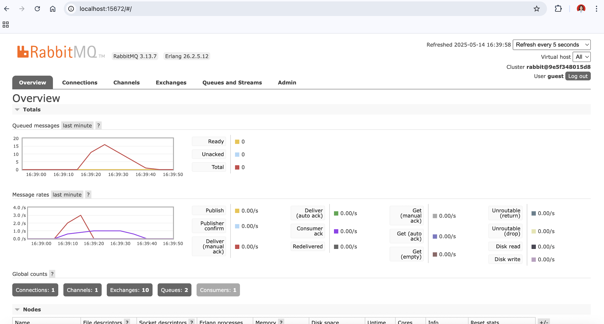
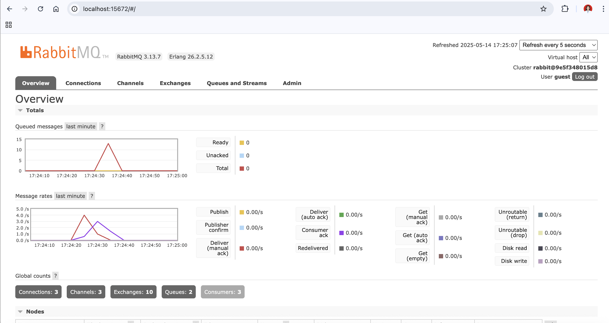

# REFLECTION - MODULE 9 - SUBSCRIBER - 2306170446 - Samuella Putri Nadia Pauntu 
## What is amqp?
AMQP (Advanced Message Queuing Protocol) is an open standard protocol for message-oriented middleware. It enables systems to communicate by sending messages through a message broker like RabbitMQ. AMQP ensures message delivery, ordering, and reliability in distributed systems.
## What does it mean? guest:guest@localhost:5672 , what is the first guest, and what is the second guest, and what is localhost:5672 is for? 
The first guest is the username (default user in RabbitMQ). The second guest is the password. localhost:5672 refers to the host (local machine) and the port number (5672 is the default port for AMQP).
So, guest:guest@localhost:5672 means we are connecting to a RabbitMQ server running locally using the guest user and password via the AMQP protocol on port 5672.

## Simulation slow subscriber

Based on the screenshot, the total number of queued messages reached 16 before dropping back down. This reflects the total number of events I published using repeated cargo run commands on the publisher. Since the subscriber was simulating slower message handling, the messages accumulated temporarily in the queue. The number 16 occurred because I ran the publisher multiple times, and the subscriber was still processing previous messages one by one. This buildup shows how a fast producer can cause a message backlog when the consumer is slower, and the exact queue size depends on how many events are sent before the subscriber catches up.

## Reflection and Running at least three subscribers

With three subscriber instances running, the message queue spike was processed much faster. The queue peaked at 13 messages but dropped quickly as each subscriber handled a portion of the load in parallel. This shows how adding more subscribers improves responsiveness and reduces delay in event-driven systems.

